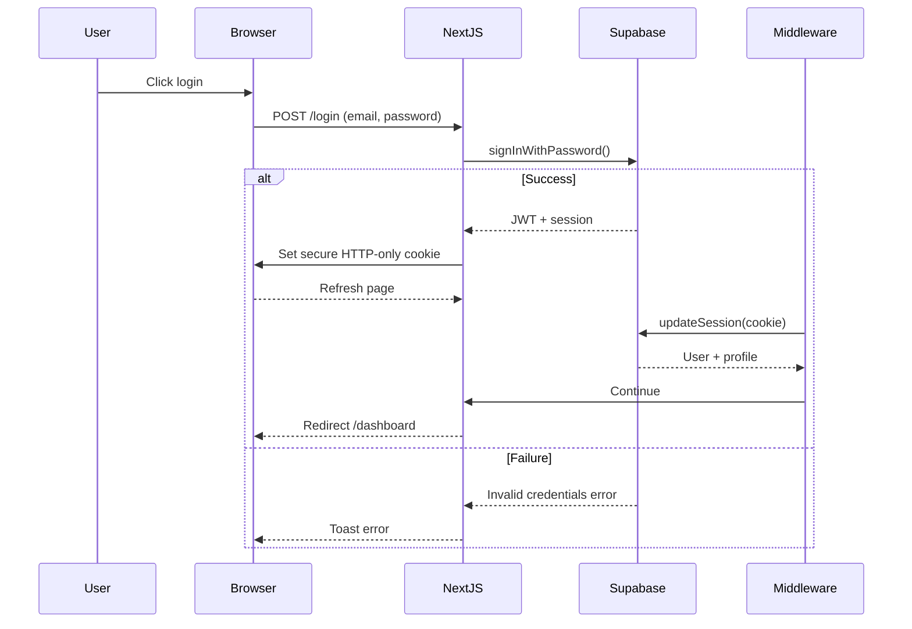
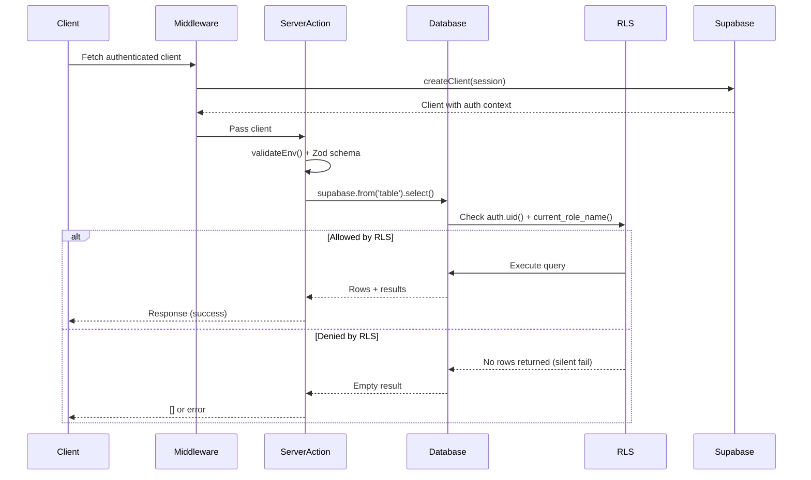
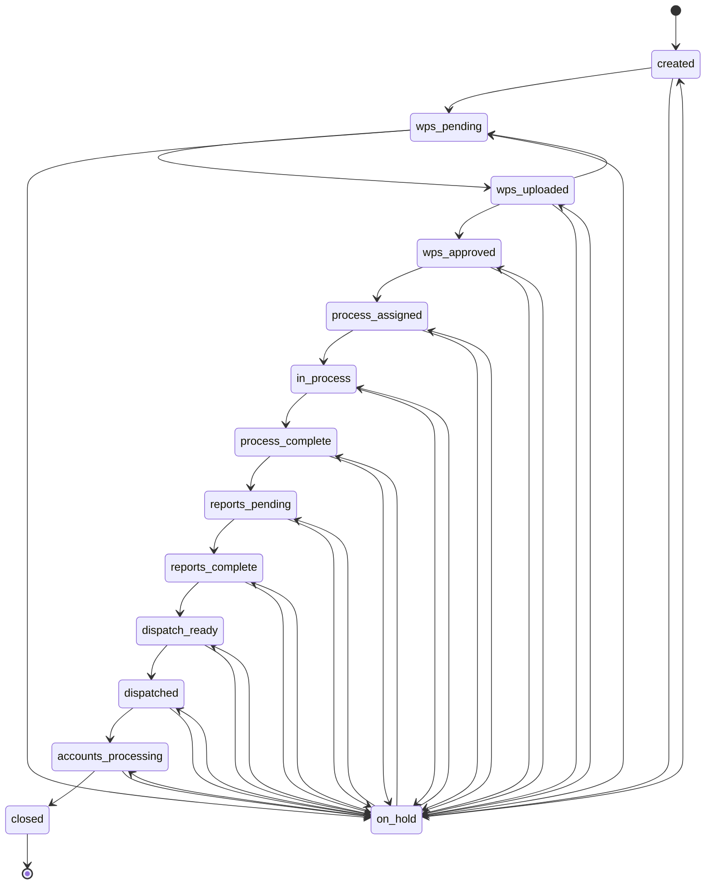
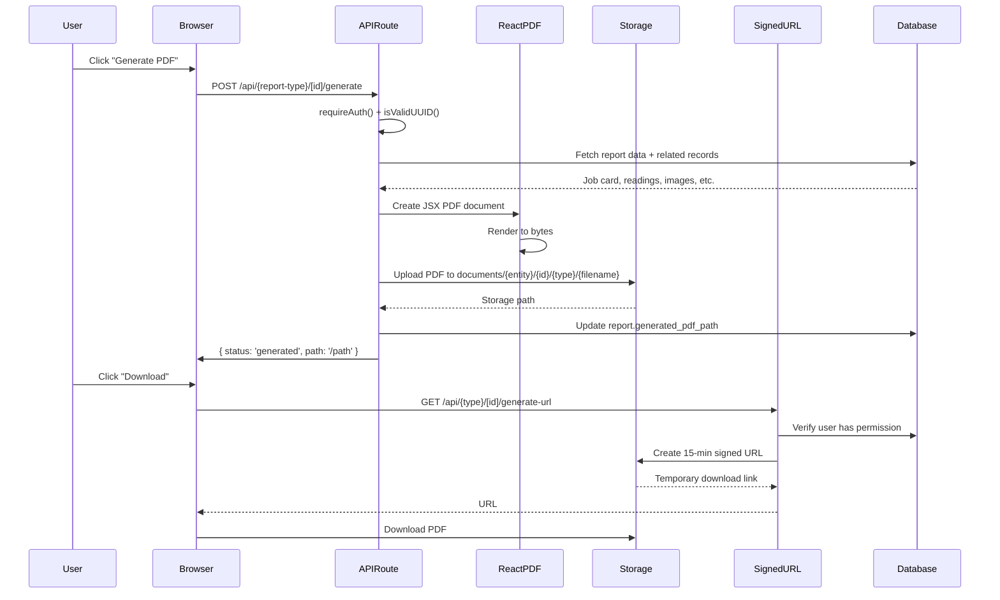
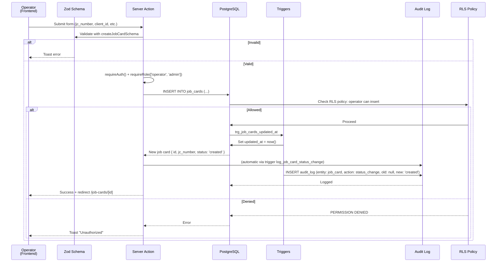
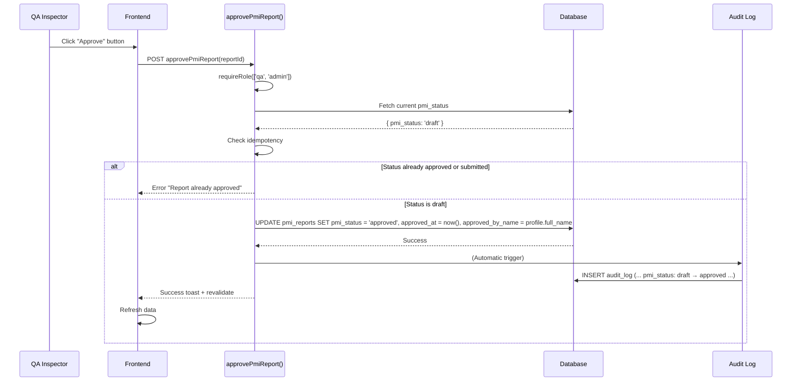

# ValveTrack ERP - Architecture & Technology Stack

---

## Part 1: Complete Technology Stack

### Frontend Technologies

#### Framework & Runtime
- **Next.js**: 14.2.35 (App Router with React 18 Server Components)
- **React**: 18.x
- **TypeScript**: 5.x (strict mode)
- **Node.js**: 20.x

#### Routing
- **Next.js App Router**: File-based routing in `src/app/`
- **Route Groups**: `(app)` for protected routes, `(auth)` for login
- **Dynamic Routes**: `[id]` for detail pages
- **Layouts**: Nested layouts per route group
- **Middleware**: `src/middleware.ts` for session, CSRF, rate limiting

#### UI & Styling
- **Tailwind CSS**: 3.4.1 (utility-first CSS)
- **shadcn/ui**: Pre-built components (Button, Input, Dialog, etc.)
- **Base UI React**: @base-ui/react 1.5.0 (low-level menu components)
  - Custom DropdownMenu built on Base UI (not Radix)
  - Requires MenuPrimitive.Group wrapping for RLS
- **Lucide React**: 1.17.0 (SVG icon library)
- **class-variance-authority**: 0.7.1 (component variants)
- **clsx**: 2.1.1 (conditional classNames)
- **tailwind-merge**: 3.6.0 (Tailwind class merging)

#### Forms & Validation
- **React Hook Form**: 7.78.0
  - Lightweight, performance-optimized forms
  - Server action integration via `handleSubmit`
- **@hookform/resolvers**: 5.4.0
  - Bridges React Hook Form with Zod
- **Zod**: 4.4.3
  - Schema validation at runtime
  - Used for API request/response validation
  - Schemas in `src/lib/validations/`

#### Tables & Data Display
- **TanStack React Table**: 8.21.3
  - Headless table library (no UI included)
  - Custom UI built with Tailwind
  - Used in job cards list, PMI reports, dimension reports, overlay reports
  - Server-side pagination integration

#### Data Fetching & State
- **@tanstack/react-query**: 5.101.0 (TanStack Query)
  - Server-side caching
  - Automatic refetch on window focus
  - Mutation cache with error toast
  - Exponential backoff retry
  - QueryDevtools in dev mode
  - Configuration in `src/components/providers/query-provider.tsx`

#### PDF Generation
- **@react-pdf/renderer**: 4.5.1
  - Server-side PDF rendering (API routes only)
  - React JSX → PDF conversion
  - Cannot be used client-side
  - Used for: PMI reports, dimensional reports, overlay reports, dossier indexes
  - PDFs stored in Supabase Storage

#### File Operations
- **jszip**: 3.10.1
  - ZIP file generation (dossier bundles)
  - Include multiple PDFs + index
  - Server-side only

#### Charts
- **Recharts**: 3.8.1
  - Data visualization (dashboard charts)
  - Line, bar, pie charts

#### Email
- **Resend**: 6.12.4
  - Transactional email service
  - HTML emails (with XSS escaping applied)
  - Used for alerts, notifications

#### Authentication & HTTP
- **@supabase/supabase-js**: 2.107.0
  - Supabase JavaScript client
  - Auth (signInWithPassword, signOut)
  - Database queries (from/select/update/insert)
  - Storage operations
- **@supabase/ssr**: 0.10.3
  - Server-side session management
  - Middleware integration
- **next-themes**: 0.4.6
  - Dark mode support (theme provider)

#### Error Tracking & Analytics
- **@sentry/nextjs**: 10.57.0
  - Error tracking
  - Performance monitoring
  - Configured in `src/instrumentation.ts`

#### Development Tools
- **@testing-library/react**: 16.3.2 (UI testing)
- **@testing-library/jest-dom**: 6.9.1 (DOM matchers)
- **jest**: 29.7.0 (test runner)
- **jest-environment-jsdom**: 29.7.0 (DOM environment)
- **ts-jest**: 29.4.11 (TypeScript for Jest)
- **ts-node**: 10.9.2 (TypeScript Node runner)
- **@types/jest**: 29.5.14 (Jest types)

---

### Backend Technologies

#### Runtime & Framework
- **Next.js API Routes**: `src/app/api/` for server endpoints
- **Server Actions**: Form submission handlers in `src/app/(app)/**/actions.ts`
- **Node.js**: 20.x runtime

#### Database
- **PostgreSQL**: 17 (via Supabase Cloud)
- **Supabase**: Managed PostgreSQL with:
  - Row-Level Security (RLS) policies
  - Real-time subscriptions (not used)
  - SQL edge functions
  - Direct SQL access

#### Authentication & Authorization
- **Supabase Auth**:
  - JWT-based session management
  - Email/password authentication
  - `auth.users` table for credentials
  - `auth.uid()` in RLS policies
- **JWT**: Stored in secure HTTP-only cookies (handled by Supabase middleware)

#### Database Access Patterns
- **No ORM**: Direct Supabase client queries
- **Query Builder**: Supabase JavaScript client provides `.from()/.select()/.insert()/.update()/.delete()`
- **Validation**: Zod schemas on request/response
- **RLS**: Database enforces permission checks; backend doesn't re-check

#### Session Management
- **Middleware**: `src/middleware.ts` updates session on every request
- **Server Actions**: `createClient()` from `src/lib/supabase/server.ts` gets authenticated client
- **Auth Guard**: `requireAuth()` in `src/lib/auth.ts` enforces active profile

#### Validation
- **Input**: Zod schemas in `src/lib/validations/`
- **LIKE Injection**: `escapeLike()` escapes `%`, `_`, `\` before `.ilike()`
- **UUID**: `isValidUUID()` regex check on dynamic params
- **Error Sanitization**: `sanitizeError()` strips Postgres patterns (no schema leakage)

#### Rate Limiting
- **In-Process**: Sliding window counter in `src/lib/rate-limit.ts`
- **Per-IP**: Uses `X-Forwarded-For` / `X-Real-IP` headers
- **Limits**:
  - Login: 5/60s (prod), 100/60s (dev)
  - API: 100/60s (prod), 1000/60s (dev)
  - Generate: 10/60min (prod), 100/60min (dev)

#### CSRF Protection
- **Origin Check**: Middleware validates `Origin` and `Referer` headers against `NEXT_PUBLIC_APP_URL`
- **Safe Methods**: GET/HEAD/OPTIONS bypassed
- **State-Changing**: POST/PUT/PATCH/DELETE checked

#### Email
- **Transactional**: Resend API integration in `src/lib/email.ts`
- **XSS Escaping**: `escapeHtml()` on all user-supplied values before template
- **Templates**: HTML literals with interpolation

#### Observability
- **Sentry**: `src/instrumentation.ts` (server), `src/instrumentation-client.ts` (client)
- **Logging**: Server-side `console.error()` before returning sanitized response
- **Error Tracking**: Caught exceptions logged to Sentry

#### Environment Validation
- **Startup Check**: `src/lib/env.ts` validates required vars
- **Fail-Fast**: Application won't start without `NEXT_PUBLIC_SUPABASE_URL` and key
- **Optional Vars**: Warn (not fail) for Sentry, Resend in production

---

### Infrastructure

#### Hosting
- **Frontend**: Vercel (Next.js optimized)
- **API Routes**: Vercel Serverless Functions
- **Database**: Supabase Cloud (AWS, region: ap-south-1)

#### Storage
- **Supabase Storage**:
  - Private bucket: `documents/`
  - File size limit: 50 MB
  - MIME types: PDF, JPEG, PNG, WebP, DOCX
  - Structure: `{entity_type}/{entity_id}/{document_type}/{file_name}`
  - Signed URLs (15 min expiry) generated server-side

#### Environment Configuration
- **Required Vars**:
  ```
  NEXT_PUBLIC_SUPABASE_URL
  NEXT_PUBLIC_SUPABASE_ANON_KEY
  NEXT_PUBLIC_APP_URL (for CSRF checks)
  ```
- **.env.local**: Local development (not committed)
- **.env.example**: Template for required vars

#### Build & Deployment
- **Build Tool**: Next.js built-in (`npm run build`)
- **Output**: `.next/` directory
- **Deployment**: `git push` to Vercel (auto-deploys main branch)
- **Database Migrations**: Manual via Supabase CLI or direct SQL (not automated in CI)

---

## Part 2: Folder Structure & Organization

```
valvetrack/
├── src/
│   ├── app/                          # Next.js App Router
│   │   ├── (auth)/
│   │   │   └── login/
│   │   │       ├── page.tsx          # Login page
│   │   │       ├── login-form.tsx    # Form with quick-login chips
│   │   │       └── layout.tsx        # Auth layout (no sidebar)
│   │   │
│   │   ├── (app)/                    # Protected routes layout
│   │   │   ├── layout.tsx            # App header + sidebar
│   │   │   ├── dashboard/
│   │   │   │   ├── page.tsx          # KPI cards + charts
│   │   │   │   └── loading.tsx       # Skeleton
│   │   │   │
│   │   │   ├── job-cards/
│   │   │   │   ├── page.tsx          # List (paginated, server-side)
│   │   │   │   ├── loading.tsx       # Table skeleton
│   │   │   │   ├── [id]/
│   │   │   │   │   ├── page.tsx      # Detail view (12 sections)
│   │   │   │   │   ├── loading.tsx
│   │   │   │   │   └── detail-actions.ts
│   │   │   │   ├── new/
│   │   │   │   │   ├── page.tsx      # Create form
│   │   │   │   │   └── loading.tsx
│   │   │   │   ├── actions.ts        # Server actions (create, status change)
│   │   │   │   ├── traveller-actions.ts
│   │   │   │   └── job-cards-client.tsx
│   │   │   │
│   │   │   ├── pmi-reports/
│   │   │   │   ├── page.tsx          # List
│   │   │   │   ├── loading.tsx
│   │   │   │   ├── [id]/
│   │   │   │   │   ├── page.tsx      # Detail + readings table
│   │   │   │   │   ├── loading.tsx
│   │   │   │   │   └── edit/
│   │   │   │   ├── new/
│   │   │   │   │   └── page.tsx
│   │   │   │   ├── actions.ts        # Approve/reject with idempotency
│   │   │   │   └── loading.tsx
│   │   │   │
│   │   │   ├── dimension-reports/    # Similar structure
│   │   │   ├── overlay-reports/      # Similar structure
│   │   │   ├── dossiers/             # Customer submission bundles
│   │   │   ├── documents/            # Central document registry
│   │   │   ├── master-data/
│   │   │   │   ├── wps/              # WPS Master CRUD
│   │   │   │   ├── consumables/      # Welding consumables
│   │   │   │   ├── chemicals/        # NDE/LPT chemicals
│   │   │   │   └── instruments/      # Inspection instruments
│   │   │   ├── search/               # Global search
│   │   │   ├── alerts/               # Unacknowledged alerts
│   │   │   ├── audit/                # Audit trail
│   │   │   ├── pwht-runs/            # Heat treatment records
│   │   │   └── settings/             # Admin settings
│   │   │
│   │   └── api/
│   │       ├── health/               # Uptime check
│   │       └── {pmi,dimension,overlay,dossiers}-reports/
│   │           └── [id]/
│   │               ├── generate/     # PDF generation endpoint
│   │               └── generate-url/ # Signed URL endpoint
│   │
│   ├── components/                   # Reusable React components
│   │   ├── layout/
│   │   │   ├── app-header.tsx        # User avatar + dropdown
│   │   │   ├── app-sidebar.tsx       # Role-based navigation
│   │   │   ├── sign-out-button.tsx   # Logout handler
│   │   │   ├── breadcrumbs.tsx       # Navigation breadcrumbs
│   │   │   └── mobile-nav.tsx        # Mobile menu (drawer)
│   │   │
│   │   ├── providers/
│   │   │   ├── query-provider.tsx    # React Query config
│   │   │   └── theme-provider.tsx    # Dark mode
│   │   │
│   │   ├── ui/                       # shadcn components
│   │   │   ├── button.tsx
│   │   │   ├── input.tsx
│   │   │   ├── dropdown-menu.tsx     # Base UI Menu wrapper
│   │   │   ├── dialog.tsx
│   │   │   ├── skeleton.tsx          # Loading placeholder
│   │   │   └── ... (20+ more)
│   │   │
│   │   ├── job-cards/
│   │   │   ├── job-cards-client.tsx  # List with pagination UI
│   │   │   └── ... (detail components)
│   │   │
│   │   └── ... (specific module components)
│   │
│   ├── lib/
│   │   ├── auth.ts                   # requireAuth(), AuthSession type
│   │   ├── security.ts               # isValidUUID, sanitizeError, escapeHtml, etc.
│   │   ├── email.ts                  # Resend email templates
│   │   ├── env.ts                    # validateEnv() at startup
│   │   ├── rate-limit.ts             # Sliding window limiter
│   │   │
│   │   ├── supabase/
│   │   │   ├── client.ts             # Client-side Supabase instance
│   │   │   ├── server.ts             # Server-side Supabase instance
│   │   │   └── middleware.ts         # Session update logic
│   │   │
│   │   ├── documents/
│   │   │   └── storage-utils.ts      # Signed URL generation
│   │   │
│   │   ├── validations/
│   │   │   ├── auth.ts               # loginSchema
│   │   │   ├── job-card.ts           # createJobCardSchema
│   │   │   ├── pmi-report.ts
│   │   │   ├── dimension-report.ts
│   │   │   └── ... (each module)
│   │   │
│   │   └── utils.ts                  # Helper functions (cn, etc.)
│   │
│   ├── types/
│   │   └── database.ts               # Generated Supabase types + custom types
│   │
│   ├── __tests__/                    # Jest test suites
│   │   ├── security.test.ts
│   │   ├── validations.test.ts
│   │   ├── rate-limit.test.ts
│   │   └── env.test.ts
│   │
│   ├── instrumentation.ts            # Server-side Sentry init
│   └── instrumentation-client.ts     # Client-side Sentry init
│
├── public/                           # Static assets
│   └── ... (favicon, etc.)
│
├── supabase/
│   └── migrations/
│       ├── 0001_schema.sql           # Base tables
│       ├── 0002_functions_triggers.sql # State machine, audit
│       ├── 0003_rls_policies.sql     # RLS on every table
│       ├── 0004_phase1_schema.sql    # Master tables (WPS, consumables, etc.)
│       ├── 0005_phase1_rls.sql       # RLS for phase 1 tables
│       ├── ... (through 0014)
│       └── 0014_phase10_dossier.sql  # Customer dossiers
│
├── .env.local                        # Local secrets (not committed)
├── .env.example                      # Template for required vars
├── .eslintrc.json                    # ESLint config
├── .gitignore                        # Git exclusions
├── jest.config.ts                    # Jest configuration
├── jest.setup.ts                     # Jest setup file
├── middleware.ts                     # Session, CSRF, rate limiting
├── next.config.mjs                   # Security headers, Image optimization
├── package.json                      # Dependencies & scripts
├── tsconfig.json                     # TypeScript config (strict)
├── tailwind.config.ts                # Tailwind customization
├── postcss.config.js                 # PostCSS (Tailwind)
└── README.md                         # Project overview

```

---

## Part 3: System Architecture Diagrams

### Authentication Flow



### Request Authorization Flow



### Job Card State Machine



**Note**: Only admin can transition to/from `on_hold`. Everyone else must follow the linear path. Transitions enforced by `enforce_job_card_status_transition()` trigger in database.

### PDF Generation & Storage Flow



---

## Part 4: Technology Rationale & Trade-offs

### Why Next.js 14 with App Router?

**Chosen**: Next.js 14 + App Router  
**Trade-off**: More mental model than Pages Router, but better for:
- Server Components reduce bundle size
- Server Actions for form handling (no REST API needed for most operations)
- Built-in middleware for session/CSRF/rate limiting
- Automatic code splitting on routes
- Streaming UI with Suspense (future enhancement)

### Why PostgreSQL + Supabase?

**Chosen**: PostgreSQL (via Supabase Cloud)  
**Trade-off**: vs. MongoDB/Firebase/DynamoDB
- ✅ Strong consistency (transactional)
- ✅ RLS (permission enforcement at database level)
- ✅ Triggers (audit logging without application code)
- ✅ SQL (complex queries, aggregations)
- ✅ Cost-effective for manufacturing (relational data)
- ❌ Requires manual migrations (unlike Firebase)
- ❌ Scaling to millions of rows requires careful indexing

### Why React Query for Server State?

**Chosen**: TanStack React Query  
**Trade-off**: vs. Redux/Zustand/other
- ✅ Automatic caching + revalidation
- ✅ Smart retry with exponential backoff
- ✅ Background refetch on window focus
- ✅ Mutation cache (optimistic updates)
- ❌ Not ideal for real-time (would need polling)
- ❌ Learning curve for cache invalidation

### Why Zod for Validation?

**Chosen**: Zod  
**Trade-off**: vs. Joi, Yup, Valibot
- ✅ TypeScript-native (infers types from schema)
- ✅ Runtime validation (works in browser and server)
- ✅ Small bundle size
- ✅ Composable schemas
- ❌ Slightly slower than native JS for large payloads

### Why Base UI Menu instead of Radix?

**Chosen**: Base UI (@base-ui/react)  
**Trade-off**: vs. Radix UI
- ✅ Built into shadcn/ui preset
- ✅ Fully unstyled (complete control)
- ❌ Requires MenuPrimitive.Group wrapper (more boilerplate)
- ❌ Smaller community than Radix
- ⚠️ Affects DropdownMenu component complexity

---

## Part 5: Data Flow for Major Workflows

### Complete Job Card Creation Flow



### PMI Report Approval with Idempotency



---

**Next document**: [HANDOFF_02_DATABASE.md](HANDOFF_02_DATABASE.md) — Complete database schema, tables, relationships, triggers, policies
